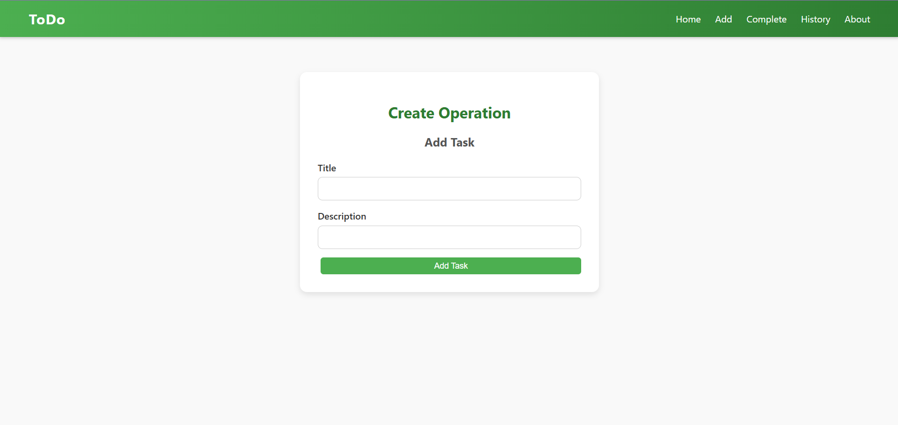
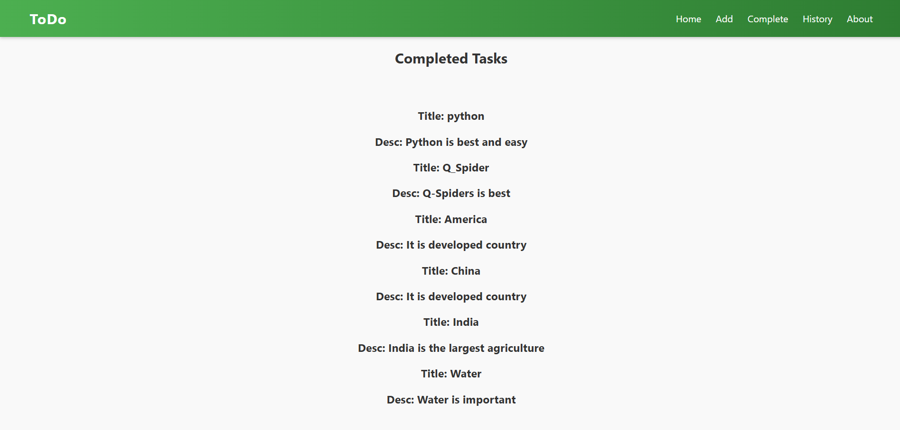

<!DOCTYPE html>
<html lang="en">
<head>
  <meta charset="UTF-8">
  <title>📝 Django TO-DO Application</title>
</head>
<body>

<h1>📝 Django TO-DO Application</h1>

A <b>Django-based TO-DO application</b> that allows users to manage their daily tasks 
by creating, updating, and deleting TO-DO items.  
It demonstrates CRUD operations, Django views, models, templates, and Bootstrap for styling.

<h2>📌 Project Objective</h2>
<ul>
  <li>Build a simple and effective task management system</li>
  <li>Allow users to add, edit, and delete tasks</li>
  <li>Mark tasks as completed or pending</li>
  <li>Learn CRUD operations in Django</li>
</ul>

<h2>📊 Screenshots</h2>

<h3>Add Task</h3>

<h3>Complete List</h3>

<h2>🛠️ Tools & Technologies</h2>
<ul>
  <li>Backend: Python, Django</li>
  <li>Frontend: HTML, CSS</li>
  <li>Database: SQLite (default)</li>
  <li>Environment: VS Code, Virtual Environment</li>
  <li>Version Control: Git & GitHub</li>
</ul>

<h2>📂 Project Structure</h2>
<pre>
TODO-Project/
│── manage.py
│── todo/                 # Main app
│   │── models.py
│   │── views.py
│   │── urls.py
│   │── templates/todo/
│── static/               # CSS, JS, Images
│── db.sqlite3
│── requirements.txt
│── README.html
│── images/               # Screenshots
</pre>

<h2>📌 Features</h2>
<ul>
  <li>Add new TO-DO tasks</li>
  <li>Edit and update tasks</li>
  <li>Mark tasks as complete/incomplete</li>
  <li>Delete tasks</li>
  <li>Simple and responsive UI with Bootstrap</li>
</ul>

<h2>🚀 How to Run Locally</h2>
<ol>
  <li>Clone the repository
    <pre>git clone https://github.com/yourusername/TO-DO-Project.git</pre>
  </li>
  <li>Navigate to the project folder
    <pre>cd TODO-Project</pre>
  </li>
  <li>Create a virtual environment
    <pre>python -m venv venv</pre>
  </li>
  <li>Activate the virtual environment
    <pre>
<!-- Windows -->
venv\Scripts\activate

<!-- Linux / Mac -->
source venv/bin/activate
    </pre>
  </li>
  <li>Install dependencies
    <pre>pip install -r requirements.txt</pre>
  </li>
  <li>Apply migrations and run the server
    <pre>
python manage.py makemigrations
python manage.py migrate
python manage.py runserver
    </pre>
  </li>
</ol>

<h2>🙋‍♂️ Author</h2>

<b>Soham Powar</b> 
B.Tech in Computer Science & Engineering 
GitHub: <a href="https://github.com/sohampowar">sohampowar</a> 
LinkedIn: <a href="https://www.linkedin.com/in/soham-powar-383593271/">Soham Powar</a>

</body>
</html>
